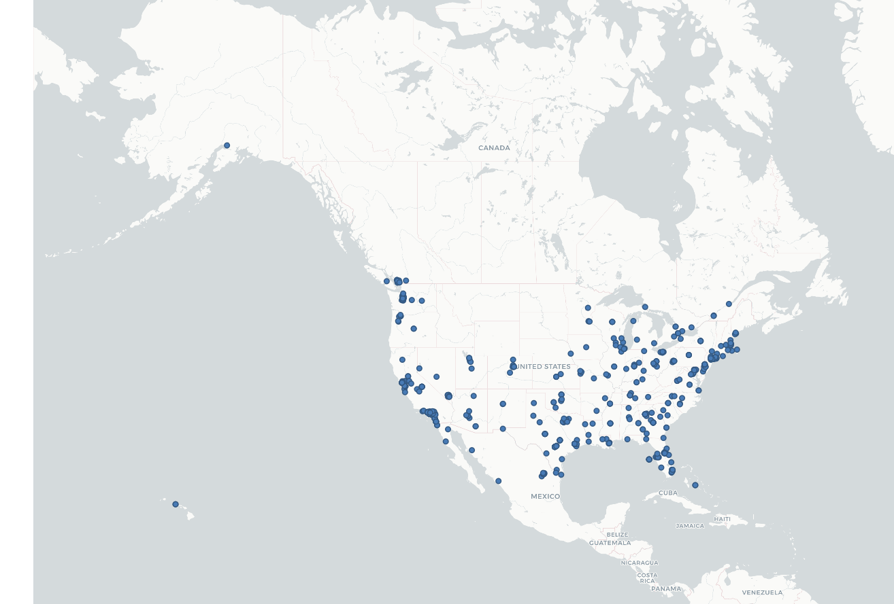

# GEOG 458 Lab 2

This is a map of around 500 randomly sampled tweets within the United States. This sample is a good indicator of the more populated areas in the US. In the northwest, one can see bunches of tweets in the cities of Seattle and Portland. In the southwest, one can see a large amount of tweets collected in the Bay Area and the Los Angeles/Orange County/San Diego area as well as bunches in the Pheonix and Las Vegas areas. Further east, one can see bigger samples gathered in Salt Lake City, Denver, Houston, Austin, Dallas, and San Antonio. Moving more to the eastern part of the US, one can see that the area is more densley populated. One could pick out Chicago, Columbus, Atlanta, Tampa, Orlando as individual standouts. The northeastern region of the United States looks the most densley populated here. That would make sense, considering the area is continously metropolitan from Washington D.C. to Boston.
